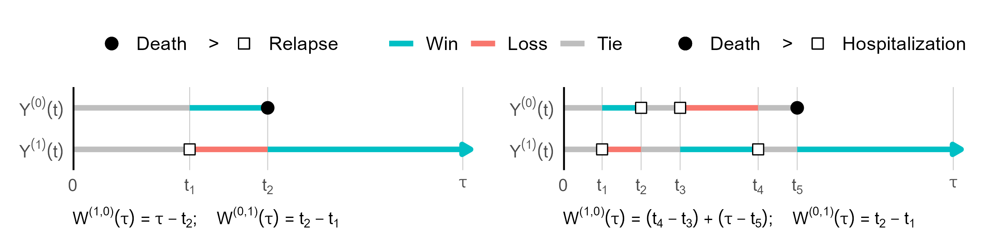

## Restricted Win Ratio {#section-1}

A restricted win ratio defines win and loss probabilities at a prespecified time horizon, τ. The comparison asks what would happen if each patient's outcome history were available through that horizon.

$$
\mathrm{WR}(\tau) = \frac{w_{1,0}(\tau)}{w_{0,1}(\tau)}
$$

Defining the target at τ does not itself solve censoring. The slides discuss estimation through inverse-probability-of-censoring weighting or imputation, under the assumptions required by those approaches.

## Average Win Time {#section-2}

Rather than summarize only which patient wins at one time, consider the time a patient spends in a more favorable state than a patient from the other group. Integrating that comparison up to τ and taking a population average leads to restricted mean time in favor of treatment (RMT-IF).

The net average win time is the treatment group's average win time minus the control group's average win time. It is measured in units of time and can be decomposed by outcome state. For a life--death outcome alone, it reduces to the difference in restricted mean survival time.

{fig-alt="Course illustration of pairwise win and loss time across ordered outcome states"}

## While-Alive Weighted Loss {#section-3}

Death limits the opportunity to accumulate nonfatal events. While-alive methods address this by relating outcome burden to time alive, with the precise estimand depending on the specified loss process and weighting.

The course introduces general while-alive estimands and nonparametric estimation, followed by an HF-ACTION analysis using `WA::LRfit()`. The interpretation of component weights and the role of survival are essential parts of that analysis.

## Selected Reading {#reading}

-   [Wang, Li & Qu (2024) · Restricted time win ratio](references.html#ref-wang2024)
-   [Mao (2023) · Restricted mean time in favor of treatment](references.html#ref-Mao2023)
