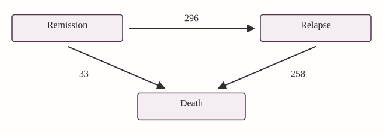
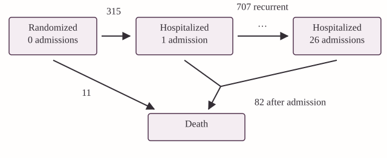
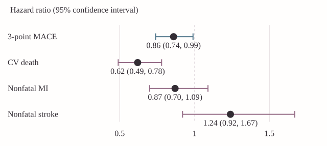
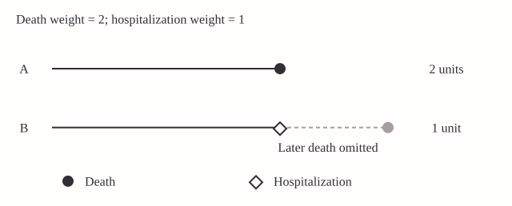
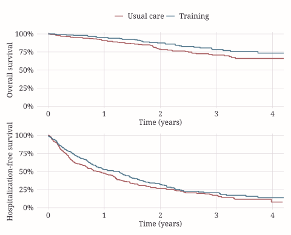
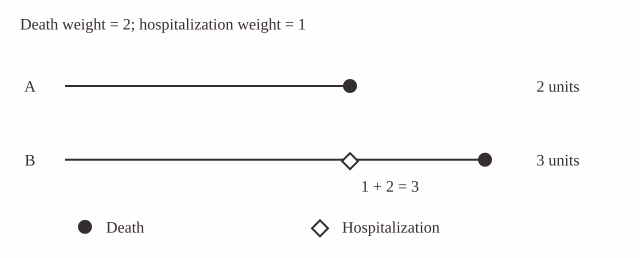
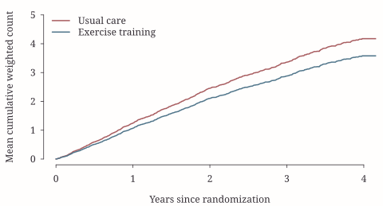
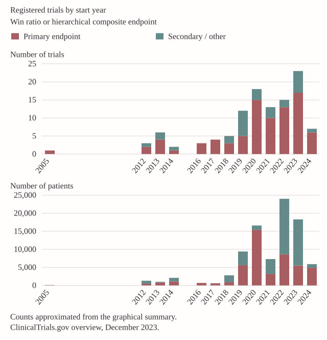
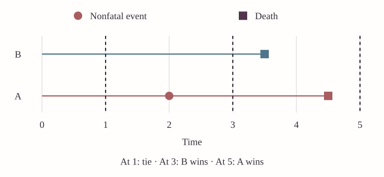

## Clinical Outcomes and Priorities {#section-1}

Does a treatment improve patients' outcomes? In a trial of patients with heart failure, we might begin with the most serious question: does treatment prolong life? Survival alone, however, does not describe the course of the disease. Some patients remain out of the hospital for years; others experience repeated admissions, each accompanied by symptoms, disruption of daily life, and additional treatment. An intervention that reduces these admissions may offer an important benefit even if its mortality effect is modest. Conversely, a reduction in admissions would be difficult to celebrate if it arose because patients died sooner.

The difficulty is not a shortage of outcomes. It is how to combine the information they provide into a treatment comparison that answers a useful clinical question. We could analyze death and hospitalization separately, but the resulting conclusions may point in different directions. We could combine them into a single endpoint, but then we must decide how a hospitalization should contribute relative to a death, and whether repeated hospitalizations should count. These decisions determine what we mean by an improved outcome.

A **composite endpoint** combines several outcome components according to a specified rule. The traditional time-to-first-event endpoint, such as time to death or first hospitalization, is one example. A weighted count of deaths and hospitalizations is another. A third approach compares patients in a sequence that reflects clinical priorities, considering survival before nonfatal events. Each construction summarizes a different aspect of the patient's experience. Choosing among them requires more than comparing their statistical power.

This chapter develops that choice through examples. We first consider why composite endpoints are used and how clinical events are represented in an analysis dataset. We then examine time-to-first-event and weighted total-event methods, using HF-ACTION as a recurring application. Their strengths and limitations motivate hierarchical comparisons and the win ratio. Finally, we distinguish the effect we wish to estimate from the comparisons that incomplete follow-up permits us to observe.

### Colon cancer: relapse and survival

In adjuvant cancer trials, treatment is given after the primary tumor has been removed, with the aim of preventing recurrence and prolonging life. The colon cancer trial reported by @Moertel1990 provides a motivating example. A relapse-free survival endpoint records the earlier of relapse and death. It recognizes relapse as an adverse outcome and includes deaths that occur without a previously recorded relapse. Once a patient relapses, however, subsequent survival does not enter that patient's first-event endpoint. A treatment that prolongs life after relapse may consequently have a benefit that this endpoint does not capture.

{#fig-colon}

@fig-colon gives a useful way to read the endpoint. A patient begins in the state of being alive without relapse. One arrow leads to relapse, another directly to death, and a further arrow connects relapse to death. The states describe the patient's condition; the arrows describe changes in that condition. Death is an absorbing state: once entered, it cannot be left.

For relapse-free survival, follow-up for the endpoint ends on leaving the initial state. The transition from relapse to death is consequently omitted from this particular analysis. For overall survival, both routes to death matter, whereas relapse itself does not constitute the endpoint. The same collected histories therefore support different statistical questions, depending on which transitions are retained.

The example compares levamisole plus fluorouracil with control in 619 patients with stage C disease (304 and 315 patients, respectively). It reports a relapse-free survival log-rank $p$-value below 0.001 and 258 deaths after relapse, approximately 89% of the deaths. The point is not that relapse-free survival is inappropriate. Rather, even a clear benefit on this endpoint leaves a further clinical question: what happened to patients after relapse? We must retain the later transitions when that question is part of the treatment comparison.

### HF-ACTION: repeated hospitalization and death

Heart failure presents a related problem with an additional feature: hospitalizations recur. HF-ACTION investigated exercise training added to usual care in patients with chronic heart failure; see @OConnor2009. We analyze a subgroup of 426 patients, with 205 assigned to exercise training and 221 to usual care. The `rmt` package identifies this teaching dataset as non-ischemic patients whose baseline cardiopulmonary exercise test lasted no more than nine minutes. These subgroup analyses should be distinguished from the primary analysis of the full trial.

There were 93 deaths in this subgroup, of which 82 occurred after a hospitalization. Thus, about 88% of the **deaths**, not 88% of the patients, occurred after the first-event endpoint had already been reached. There were also 707 recurrent hospitalizations excluded by retaining only the first event. These later events remain clinically meaningful even though they do not enter a time-to-first-event analysis.

{#fig-hf-states}

In @fig-hf-states, the living states distinguish how many hospitalizations a patient has experienced. An admission moves the patient to the next count state. It does not imply that the patient remains physically in the hospital: a patient discharged after a first admission still has one accumulated hospitalization. Death can occur before any admission, after the first, or after several. @fig-hf-states therefore records a history of events rather than a sequence of hospital occupancy states.

A first-event analysis uses only the first departure from the initial state. It treats admission and death as alternative ways to leave that state and makes no further use of the patient's subsequent transitions. A total-event analysis instead counts subsequent admissions. A survival-prioritized analysis uses both types of information but asks about survival first. Keeping @fig-hf-states in view helps us distinguish these constructions before introducing their formulas.

The question is therefore broader than whether exercise postpones the first adverse event. We may also wish to know whether it prolongs survival, reduces repeated admissions, or improves the overall course of illness when survival takes priority. We will return to the same patients as we change the way their histories are summarized.

## Why Combine Outcomes? {#why-combine}

There are both clinical and statistical reasons to use a composite. Clinically, several events may express different consequences of the same disease. Combining them can provide a more complete description of treatment benefit than any one component. Statistically, a composite may accumulate more events than a mortality endpoint alone, allowing a comparison to use information from patients who experience important nonfatal outcomes.

For many years, the usual way to make this comparison has been time to the first component event. The approach produces one event time per patient and can be analyzed with familiar Kaplan–Meier curves, log-rank tests, and Cox models. It is consequently straightforward to prespecify, implement, and communicate. When remaining alive without any component event is the clinical goal, it also provides a direct and useful summary.

More events do not automatically imply a more informative comparison. Suppose a treatment has a substantial effect on mortality but little effect on a frequent, less serious event. Adding that event to a first-event composite may increase the event count while moving the treatment contrast toward the null. Whether precision and power improve depends on event frequencies, dependence between components, treatment effects, and the rule used to combine them. A composite should therefore be justified by the clinical question before its operating characteristics are assessed.

Another motivation is to define a single primary comparison. ICH E9 [@ich1998] discusses combining multiple measurements into a prespecified composite variable when one measurement cannot adequately represent the primary objective. A single test of this composite addresses a single hypothesis. It does not make additional claims about each component exempt from multiplicity considerations. Evidence of benefit on a composite is not, by itself, evidence of benefit on every component.

Interpretation requires examining what contributed to the result. The FDA's *Multiple Endpoints in Clinical Trials* [@fda2022] guidance emphasizes component analyses when interpreting a composite. The EUnetHTA guidance [@EUnetHTA2015] emphasizes the clinical importance of components and their separate reporting. Whenever we present a composite effect, we should explain which outcomes enter it, how they enter, and what the individual components show.

For HF-ACTION, reporting only a treatment coefficient would leave several questions unanswered. Did the analysis include all hospitalizations or only the first? Did death receive the same numerical contribution as hospitalization, a larger weight, or hierarchical priority? Over what period were outcomes compared? The methods below give different answers. Their estimates should be interpreted accordingly.

### A composite effect and its components: EMPA-REG

The EMPA-REG OUTCOME trial illustrates why the composite estimate should be read together with its components. As reported by @Zinman2015, 7,020 patients with type 2 diabetes were studied, and the primary three-point major adverse cardiovascular event endpoint combined cardiovascular death, nonfatal myocardial infarction, and nonfatal stroke.

{#fig-empa}

The composite risk ratio was 0.86, compared with 0.62 for cardiovascular death, 0.87 for nonfatal myocardial infarction, and 1.24 for nonfatal stroke. The confidence intervals in @fig-empa are essential: the estimates for the nonfatal components are less conclusive, and a point estimate above one for stroke should not alone be read as evidence of harm. Nevertheless, the pattern makes clear that the composite does not describe a common proportional reduction in every component.

Why can the overall estimate be nearer one than the mortality estimate? The first-event endpoint includes nonfatal events that may respond differently to treatment. Patients who experience one of these events have reached the endpoint even if their subsequent survival is improved. The composite coefficient is not a simple arithmetic average of the component coefficients; event timing and the changing risk sets also enter the analysis. @fig-empa motivates examining component effects without interpreting a difference in their individual significance levels as a formal test of heterogeneity.

### Constructing the endpoint before collecting the data

This guidance can be translated into concrete design decisions. Define each component clinically, including its ascertainment and adjudication. Specify how multiple occurrences, simultaneous events, and deaths are handled. Choose the summary that corresponds to the trial objective, and describe component analyses that will make the primary result interpretable. For a hierarchical endpoint, also specify the order of comparison and any clinically meaningful thresholds used to declare a win.

Combining events of similar importance, as emphasized in the European guidance, makes a first-event summary easier to interpret. When priorities differ substantially, a hierarchy makes those priorities explicit. Neither approach eliminates the need to report components. Mortality deserves particular attention whenever it prevents observation of subsequent nonfatal outcomes. Treating such deaths as ordinary censoring in an analysis of hospitalization would answer a different question and generally require additional justification.

## From a Patient History to an Analysis Dataset {#data-history}

A statistical analysis begins with the patient histories that the study records. We first describe those histories mathematically, then examine their representation as rows and variables in the HF-ACTION data. The notation is useful only insofar as it keeps the statistical object connected to those records.

### Events, follow-up, and censoring

Let $D$ denote time from randomization to death. For one type of nonfatal event, let $N_H(t)$ be the number of hospitalizations experienced by time $t$. This is a counting process: it begins at zero and increases by one at each hospitalization. Define $N_D(t)=I(D\leq t)$, where $I(\cdot)$ equals one when its condition holds and zero otherwise. Unlike hospitalization, death can occur only once and prevents subsequent hospitalizations.

The full event history through time $t$ records when these processes change:

$$
\mathcal H(t)=\{N_D(u),N_H(u):0\leq u\leq t\}.
$$

The notation represents information that a clinical study collects: dates of admissions, a date of death if applicable, and the period during which events were ascertained. With several nonfatal event types, we can replace $N_H$ by separate counting processes for hospitalization, stroke, or other prespecified components. Defining these events consistently is part of endpoint construction; no statistical procedure can repair an ambiguous clinical definition after data collection.

Let $C$ be the time at which observation would end for a reason other than death. We observe the event history through $X=\min(D,C)$. If a patient is alive when observation ends, we know only that the death time exceeds $C$. This is right censoring. A record of censoring is information about the end of observation, not an adverse event.

Many methods require independent censoring, possibly conditional on treatment and measured covariates. In practical terms, among comparable patients still under follow-up, the end of observation must not selectively remove those with different unobserved future outcomes. Withdrawal prompted by worsening unrecorded symptoms may violate this requirement. Administrative study closure may be more compatible with it, but that still depends on study design and any relationship between enrollment time and prognosis. Randomization of treatment does not guarantee independent censoring.

Death deserves separate treatment. When hospitalizations are the outcome, death is not simply loss of contact with a patient who could continue to be hospitalized. It ends the possibility of future admissions. A composite that includes death explicitly acknowledges this distinction.

### Several nonfatal components

For a general formulation, let $N_k^*(t)$ count nonfatal events of type $k$, for $k=1,\ldots,K$, and write $N_D^*(t)=I(D\leq t)$. The superscript emphasizes the full process, before incomplete observation is imposed. Then

$$
\mathcal H^*(t)=\{N_D^*(u),N_1^*(u),\ldots,N_K^*(u):0\leq u\leq t\},
\qquad X=D\wedge C.
$$

The symbol $\wedge$ denotes the minimum, so the observed record is $\{\mathcal H^*(X),X\}$. The distinction between the full history and the observed record is substantive. The treatment effect concerns the outcomes that patients would experience under the treatment conditions being compared; the estimator uses the histories the study was able to observe to learn about that effect. In the HF-ACTION illustrations below, there is one nonfatal component, hospitalization, which can recur.

### The subgroup at baseline and during follow-up

@tbl-hf-baseline summarizes the subgroup. It gives a sense of the population and the amount of follow-up before we fit a model.

| Characteristic | Category | Usual care ($N=221$) | Exercise training ($N=205$) |
| --- | --- | ---: | ---: |
| Age | $\leq60$ years | 122 (55.2%) | 128 (62.4%) |
| | $>60$ years | 99 (44.8%) | 77 (37.6%) |
| Follow-up, months |  | 28.6 (18.4, 39.3) | 27.6 (19, 40.2) |
| Death | | 57 (25.8%) | 36 (17.6%) |
| Hospitalizations | 0 | 51 (23.1%) | 60 (29.3%) |
| | 1–3 | 114 (51.6%) | 102 (49.8%) |
| | 4–10 | 49 (22.2%) | 39 (19.0%) |
| | $>10$ | 7 (3.2%) | 4 (2.0%) |

: Baseline characteristics and observed outcomes in the HF-ACTION subgroup. {#tbl-hf-baseline}

The hospitalization categories reveal substantial recurrence. A single binary indicator of whether hospitalization ever occurred would hide the distinction between one admission and more than ten. The mortality percentages are crude observed proportions, not estimated death probabilities at a common time. Patients have different lengths of follow-up, so a survival analysis is needed to compare mortality over a specified period. @tbl-hf-baseline describes the data; it does not replace that analysis.

### Reading the HF-ACTION data in R

We begin with the HF-ACTION dataset. The following commands load the data and display its first records; they do not fit a model.

```{r}
library(rmt)      # HF-ACTION teaching dataset
library(dplyr)    # Data preparation
library(survival) # Kaplan-Meier and Cox methods

data("hfaction", package = "rmt")
hf <- hfaction

# Inspect event records: a participant can occupy several rows.
head(hf)
```

```{.output}
       patid       time status trt_ab age60
1 HFACT00001 0.60506502      1      0     1
2 HFACT00001 1.04859685      0      0     1
3 HFACT00002 0.06297057      1      0     1
4 HFACT00002 0.35865845      1      0     1
5 HFACT00002 0.39698836      1      0     1
6 HFACT00002 3.83299110      0      0     1
```

The object is named `hf` here so that the original `hfaction` data remain available unchanged.

@tbl-hf-variables defines the variables used in the analysis. The dataset uses long format: a patient can contribute several rows. In the original coding, `status = 1` denotes hospitalization, `status = 2` denotes death, and `status = 0` marks the end of follow-up without death. We retain this coding in `hf`; later, we create a separate variable for the coding required by `Wcompo`.

| Variable | Meaning in the study | Role in analysis |
| --- | --- | --- |
| `patid` | Identifier for one participant | Connects repeated records from the same patient |
| `time` | Years from randomization to the recorded event or end of follow-up | Places events on a common time scale |
| `status` | Hospitalization, death, or censoring, coded as above | Distinguishes outcomes from the end of observation |
| `trt_ab` | Randomized assignment: 1 for exercise training, 0 for usual care | Defines the treatment contrast |

: Variables in the HF-ACTION event-history data. {#tbl-hf-variables}

The dataset also includes `age60`, a baseline age-group indicator. We do not use it in the treatment-only analyses here. The package documentation [@rmt-software] describes the dataset and its variables.

For example, the displayed records show one patient hospitalized at about 0.605 years and then censored at about 1.049 years. The second record does not undo the hospitalization. Together, the records say that an admission occurred and observation subsequently ended while the patient was alive. For another patient, several hospitalization rows precede a final follow-up record. Counting rows as if they represented independent patients would overstate the sample size and give patients with more events more representation in a baseline summary.

To count participants, we first retain one treatment record per identifier:

```{r}
# Count each randomized participant once, not once per event.
hf |>
  distinct(patid, trt_ab) |>
  count(trt_ab, name = "patients")
```

```{.output}
  trt_ab patients
       0      221
       1      205
```

There are 221 patients in the usual-care arm and 205 in the exercise-training arm.

Here `distinct()` removes repetitions of the same patient and treatment assignment; `count()` then counts patients within each arm. The unit stored in a row need not be the unit randomized in the trial.

## Time to First Event {#section-2}

The traditional time-to-first-event analysis reduces each history to one event time. It has long been the default analysis for many composite endpoints because it gives each patient a single, familiar survival outcome. We examine what this reduction preserves, how to construct it in R, and how to interpret the resulting treatment comparison. The reduction is sensible when remaining alive without any component event is itself the clinical objective.

### What does the endpoint measure?

Let $T_H$ be time to the first hospitalization, taking $T_H=\infty$ if no hospitalization occurs before death. The first-event composite is

$$
T_F=\min(D,T_H).
$$

Its survival function $S_F(t)=\Pr(T_F>t)$ is the probability of being alive and having had no hospitalization through time $t$. A death without prior hospitalization and a first hospitalization both end this event-free period. Their clinical severity may differ, but either is sufficient to reach the endpoint.

Consider two hypothetical patients followed for four years. Patient A is hospitalized at six months and remains alive at four years. Patient B has no hospitalization but dies at one year. Their first-event times are six months and one year, respectively. Thus, B has the longer event-free time. This is consistent with the definition of $T_F$, although a survival-first assessment would favor A. The example makes clear why the endpoint must be chosen with the intended interpretation in mind.

The first-event composite is useful when postponement of any component event is itself the clinical objective. It also permits established survival-analysis methods, which is one reason for its central role in trial practice. Its limitation is the information it omits: neither additional admissions nor death after the first admission changes $T_F$. We should not expect it to answer questions about the entire subsequent course of illness.

### What weighting the first event can and cannot recover

In the general notation, the first-event process is

$$
N_{\mathrm{TFE}}^*(t)=I\left\{N_D^*(t)+\sum_{k=1}^K N_k^*(t)\geq1\right\}.
$$

Once this indicator becomes one, it stays one. The later course of illness cannot change it. Assigning a larger contribution to a first event that is fatal may distinguish event types, but it still cannot recover a death that follows an earlier nonfatal event if the analysis has already stopped at that first event.

{#fig-first-weight}

Read each line in @fig-first-weight from left to right. One patient reaches death directly; another is hospitalized before dying. A procedure that retains only the first event sees death for the first patient and hospitalization for the second. The second patient's later death is absent from the retained endpoint. This is a loss of information about the trajectory, not merely a choice of numerical weight.

### Preparing one record per patient

For a mortality analysis, we retain each patient's death or final censoring record, removing the hospitalization rows. For a first-event analysis, we retain the earliest record. If no event occurred, that earliest and only record is censoring.

```{r}
# Retain death or censoring; admissions do not end survival follow-up.
hf_death <- hf |>
  filter(status %in% c(0, 2)) |>
  mutate(death = status == 2)

# Order records within each patient; retain the earliest event or censoring.
hf_first <- hf |>
  arrange(patid, time, desc(status)) |>
  group_by(patid) |>
  slice_head(n = 1) |>
  ungroup() |>
  mutate(event = status != 0)
```

`death` and `event` are logical variables, equal to `TRUE` when the specified endpoint occurred. In `hf_death`, a prior hospitalization does not terminate mortality follow-up: its row is removed, but the later death or censoring time is retained. In `hf_first`, follow-up for the composite stops at the first event.

Sorting by `desc(status)` places death before hospitalization and both before censoring if recorded times coincide. For the binary first-event indicator, either event counts as an event; the convention also makes selection of the retained row explicit. In other datasets, simultaneous events and their adjudication require a prespecified rule rather than an assumption based on row order.

This preparation assumes the event-record structure described above, including one terminal death or censoring record per patient. Before using it on a new study, we would check identifiers, event coding, ordering of dates, and completeness of terminal records. A discharge date, an admission date, and an interval length are not interchangeable inputs to `time`.

### Fitting and interpreting the models

The Cox model compares event hazards between treatment groups. For mortality, write

$$
\lambda_D(t\mid Z)=\lambda_{D0}(t)\exp(\beta_D Z),
$$

where $Z=1$ denotes training and $Z=0$ denotes usual care. The hazard describes the instantaneous event occurrence rate among those still at risk. We refer to $\exp(\beta_D)$ as the treatment-to-control **risk ratio**; it is also commonly called the hazard ratio. Proportional hazards means that this risk ratio does not change with time. For the first-event model, the risk set instead consists of patients who are alive and have not yet been hospitalized.

```{r}
# Mortality model: time is in years; death marks observed deaths.
fit_death <- coxph(
  Surv(time, death) ~ trt_ab,
  data = hf_death
)

# Composite model: event marks the first admission or death.
fit_first <- coxph(
  Surv(time, event) ~ trt_ab,
  data = hf_first
)

# exp(coef) compares training (1) with usual care (0).
summary(fit_death)
summary(fit_first)
```

```{.output}
Mortality
n = 426, number of events = 93

          coef exp(coef) se(coef)      z      p
trt_ab -0.3973    0.6721   0.2129 -1.866 0.0621

Death or first hospitalization
n = 426, number of events = 326

          coef exp(coef) se(coef)      z      p
trt_ab -0.1770    0.8378   0.1112 -1.592  0.111
```

`Surv()` combines follow-up time and the indicator of an observed endpoint. The formula `~ trt_ab` specifies a treatment-only comparison. In the model summary, `coef` is the estimated log risk ratio, whereas `exp(coef)` is the risk ratio itself. Standard errors and confidence intervals quantify sampling uncertainty; the test of a zero coefficient is a test of a risk ratio of one under the model.

@tbl-hf-cox summarizes the two fitted treatment contrasts.

| Endpoint | Observed endpoint events | Risk ratio, training versus usual care | Reported $p$-value |
| --- | ---: | ---: | ---: |
| Death | 93 | 0.672 | 0.062 |
| Death or first hospitalization | 326 | 0.838 | 0.111 |

: Treatment-only Cox model results in HF-ACTION. {#tbl-hf-cox}

Exercise training was associated with an estimated 32.8% lower instantaneous risk of death (risk ratio, 0.672), under the proportional-hazards and censoring assumptions. This comparison is made at each time among patients still alive. It does not say that the four-year probability of death was lower by 32.8%; that question calls for estimated mortality probabilities at four years. Similarly, the first-event risk ratio describes death or an initial hospitalization among patients still free of both, rather than the rate of all hospitalizations.

Neither reported test rejects its null at the conventional 5% level. More importantly, the difference between the two $p$-values is not a test that exercise affects death more than hospitalization. The analyses concern different endpoints, with different risk sets and precision. They illustrate that adding events changes the clinical comparison as well as the amount of information.

Survival curves help communicate the corresponding probabilities:

```{r}
library(ggsurvfit)
library(patchwork)

# Shared appearance; muted red = usual care, blue = training.
book_theme <- theme_minimal(base_size = 12, base_family = "Georgia") +
  theme(panel.grid.minor = element_blank(),
        panel.grid.major = element_line(color = "#ded5da", linewidth = 0.3),
        text = element_text(color = "#332d34"),
        axis.text = element_text(size = 12, color = "#332d34"),
        axis.title = element_text(size = 12),
        legend.text = element_text(size = 12),
        plot.background = element_rect(fill = "#fffefd", color = NA),
        legend.position = "top", legend.title = element_blank())

# Mortality follow-up continues after hospitalization.
p_death <- survfit2(Surv(time, death) ~ trt_ab, data = hf_death) |>
  ggsurvfit(linewidth = 0.7) + scale_ggsurvfit() +
  scale_color_manual(values = c("#a85d60", "#50758a"),
                     labels = c("Usual care", "Training")) +
  scale_x_continuous("Time (years)", breaks = 0:4) +
  coord_cartesian(xlim = c(0, 4)) +
  labs(y = "Overall survival")

# Here the first hospitalization or death ends event-free follow-up.
p_first <- survfit2(Surv(time, event) ~ trt_ab, data = hf_first) |>
  ggsurvfit(linewidth = 0.7) + scale_ggsurvfit() +
  scale_color_manual(values = c("#a85d60", "#50758a"),
                     labels = c("Usual care", "Training")) +
  scale_x_continuous("Time (years)", breaks = 0:4) +
  coord_cartesian(xlim = c(0, 4)) +
  labs(y = "Hospitalization-free survival")

# Stack the two endpoints and share one treatment legend.
(p_death / p_first + plot_layout(guides = "collect")) & book_theme

```

`survfit2()` fits the survival curves; `ggsurvfit()` displays them using the `ggplot2` graphics system. `scale_ggsurvfit()` formats the survival scale, and the color labels translate treatment codes into clinical group names. `plot_layout(guides = "collect")` combines the panels with one legend; `/` stacks them vertically. `book_theme` sets the typeface, text size, and grid while preserving the treatment colors. The code therefore changes only the presentation, not the event histories or fitted estimates. @fig-hf-survival displays the resulting curves.

{#fig-hf-survival}

In @fig-hf-survival, the overall-survival panel follows patients after a hospitalization, whereas the hospitalization-free panel stops their event-free follow-up at the first admission. The curves therefore have different vertical interpretations even though their horizontal axes agree. The second panel has more endpoint events and falls more rapidly. That does not mean it captures a larger treatment benefit: the treatment contrast depends on how the intervention affects the components as well as their frequency.

The log-rank test gives a $p$-value of 0.100 for hospitalization-free survival. @tbl-hf-cox reports a Wald $p$-value of 0.111. These are different test statistics for the same endpoint, so the slight numerical difference is not a contradiction. In reporting an analysis, we should name the test rather than treating the two values as interchangeable.

The first plot addresses survival; the second addresses remaining alive without a hospitalization. Comparing them draws attention to the clinical meaning of the endpoint rather than just the coefficient. In a completed analysis, confidence intervals, numbers at risk, and assessment of proportional hazards would accompany interpretation. Changing the endpoint should not be a way to search for a smaller $p$-value after seeing the data.

## Retaining Recurrent Events {#weighted-events}

Repeated admissions provide information that a first-event endpoint discards. A weighted cumulative count retains these events while making explicit the relative contribution assigned to death.

### Weighted cumulative burden

To include all hospitalizations, consider the weighted cumulative count

$$
N_W(t)=w_DN_D(t)+w_HN_H(t),
$$

with prespecified positive weights $w_D$ and $w_H$. Choosing $w_D=2$ and $w_H=1$ adds one unit for each hospitalization and two units for death. A patient with three admissions followed by death contributes five units after death; a living patient with three admissions contributes three. The count stops changing after death, because no further events can occur.

{#fig-total-weight}

As illustrated in @fig-total-weight, unlike the first-event construction in @fig-first-weight, this score retains the death that occurs after hospitalization. For multiple nonfatal components, the corresponding score is

$$
N_W^*(t)=w_DN_D^*(t)+\sum_{k=1}^K w_kN_k^*(t).
$$

Each weight has a clinical interpretation only relative to the others. Multiplying every weight by the same positive constant changes the units of burden but not a ratio of group means. Changing the relative weights changes the endpoint itself. We should therefore explain the choice of weights and examine clinically reasonable alternatives when that choice is uncertain.

The weights express a quantitative trade-off. A death contributes twice as much as a hospitalization in this example, but sufficiently many hospitalizations can outweigh a death. This differs from a hierarchical rule under which survival, whenever it decides the comparison, takes precedence over every nonfatal component. Calling death “more important” does not itself choose between these two meanings. Investigators must decide which comparison addresses their objective.

The proportional means model of @Mao2016 relates the expected weighted count to covariates. With treatment as the only covariate,

$$
E\{N_W(t)\mid Z\}=\mu_0(t)\exp(\beta_W Z).
$$

Here $\mu_0(t)$ is the mean cumulative weighted count under usual care, and $\exp(\beta_W)$ is its treatment-to-control ratio. The model assumes this ratio is constant over time. It does not require admissions from the same patient to be independent. Rather, the analysis must account for their common patient membership.

### Software: `Wcompo::CompoML()` {#software-compoml}

The function `CompoML()` in the **Wcompo** package fits the proportional means model for a weighted composite of recurrent events and death [@wcompo-software]. Before applying it to HF-ACTION, we describe the interface. The basic call is

```r
# Generic syntax: replace these names with your event-history data.
obj <- Wcompo::CompoML(
  id = id,
  time = time,
  status = status,
  Z = Z,
  w = c(2, 1)
)
```

Here `id`, `time`, `status`, and `Z` are placeholders for the analyst's data objects. The function takes vectors and a covariate matrix directly, rather than a model formula and a `data` argument. Each row describes an observed event or the end of observation for a patient. Recurrent events therefore require repeated records for the same patient, not a single row containing only the first event.

- **`id` identifies the patient.** The same identifier must appear on every record belonging to that patient. It connects a sequence of admissions and the final death or censoring record to one individual.
- **`time` records time from a common origin.** In a randomized trial this will usually be time since randomization. All records must use the same unit. Thus, a value of 2 means two years if times are supplied in years; it does not mean two years since the preceding admission.
- **`status` identifies the record type.** Use 0 for censoring, 1 for death, and 2, 3, and so on for distinct nonfatal event types. A hospitalization is an event record, not the end of mortality follow-up. Death terminates the event history; censoring marks the end of observation without an observed death.
- **`Z` is the covariate matrix.** It has one row for every supplied record and one column for each covariate. The covariates must be time-constant, so each patient's values are repeated across that patient's records. For a treatment-only model, supply the treatment indicator as a one-column matrix. An intercept column is unnecessary because the baseline mean function supplies the reference level.
- **`w` assigns weights to event types.** Its first entry weights death, its second weights event type 2, and so forth. Censoring receives no entry. Thus, `w = c(2, 1)` gives death twice the weight of the single nonfatal event type. Omitting `w`, or setting `w = NULL`, assigns unit weight to every event type.

The vectors must have equal lengths, and their record order must agree with the rows of `Z`. Before fitting the model, check these alignments and the status coding: a correctly executed call can still analyze the wrong endpoint if the event labels and weights do not match. The optional argument `ep`, with default `1e-04`, controls the convergence threshold of the Newton–Raphson algorithm. It is a numerical tolerance, not a clinical threshold or a hypothesis-testing level.

The returned object, here named `obj`, has class `CompoML`. Printing it displays the weights and regression results. Its principal components are `obj$beta`, the estimated log-mean-ratio coefficients; `obj$var`, their estimated covariance matrix; and `obj$t` and `obj$y`, the event-time grid and estimated baseline cumulative mean function. For example,

```r
# Extract estimates from a fitted CompoML object.
exp(obj$beta)          # Mean ratios for one-unit covariate increases
sqrt(diag(obj$var))    # Standard errors on the log-mean-ratio scale

# z supplies a covariate profile in the same order as the columns of Z.
plot(obj, z = z)
```

For a binary treatment indicator coded 0 for control and 1 for treatment, `exp(obj$beta)` is the treatment-to-control mean ratio in the treatment-only model. With additional covariates, each coefficient compares patients differing by one unit in that covariate while holding the others fixed. The plotting method evaluates

$$
\widehat\mu(t\mid z)=\widehat\mu_0(t)\exp(\widehat\beta^{\mathsf T}z).
$$

Thus, `z = 0` requests the control curve in a treatment-only model, whereas `z = 1` requests the treatment curve. With several covariates, `z` must contain the complete profile. The horizontal axis retains the unit supplied in `time`, and the vertical axis gives the expected cumulative count in the units defined by `w`. These are fitted means under the proportional means model; calling the function does not itself establish that the model or the censoring assumptions are appropriate.

### Applying `CompoML()` to HF-ACTION

`Wcompo::CompoML()` expects death to be coded as 1 and the nonfatal event as 2, the reverse of the original `hfaction` coding. We create a new variable so that the original clinical labels remain recoverable.

```{r}
library(Wcompo)

# Recode event types for Wcompo without changing the original status.
hf_weighted <- hf |>
  mutate(status_w = case_when(
    status == 0 ~ 0L, # Censoring
    status == 2 ~ 1L, # Death
    status == 1 ~ 2L  # Hospitalization
  ))

# Use all event records; patid links repeated admissions to a patient.
fit_weighted <- CompoML(
  id = hf_weighted$patid,
  time = hf_weighted$time,
  status = hf_weighted$status_w,
  Z = as.matrix(hf_weighted["trt_ab"]),
  w = c(2, 1) # Weights in status_w order: death, hospitalization
)

fit_weighted
```

```{.output}
Weighted total events

          Event 1 (Death) Event 2
Weight                 2       1

        Estimate      se z.value p.value
trt_ab  -0.15398 0.11215 -1.3729  0.1698
```

The first part of the output confirms the endpoint that was fitted. We should read it before interpreting the coefficient: event 1 is death, with weight two, and event 2 is hospitalization, with weight one. `Estimate` is on the log-mean scale. Exponentiating it changes the scale to the ratio of expected cumulative weighted counts; it does not change the endpoint definition.

All event and terminal records remain in this analysis. `id` links records from the same participant; `Z` supplies the treatment indicator as a one-column matrix, repeated across that participant's records. The weight vector follows the recoded event order: death first, hospitalization second. Assigning the right weights to the wrong event codes would fit a different endpoint. The software reference [@wcompo-software] specifies the interface.

The treatment-only analysis gives $\widehat\beta_W=-0.15398$, giving a mean ratio of approximately 0.857, with $p=0.170$. Under the model, the training group has an estimated 14.3% lower **mean cumulative weighted count**. Because death contributes two units and each hospitalization one, this is a comparison of the specified combined burden over follow-up. It is neither a mortality risk ratio nor a 14.3% reduction in the probability of any event. Its units and interpretation depend on the weights.

The fitted object also contains `fit_weighted$beta`, the estimated log-mean coefficients, and `fit_weighted$var`, their estimated covariance matrix. The square roots of its diagonal entries give the coefficient standard errors. These are patient-level uncertainty calculations, not calculations that treat the hospitalization rows as independent patients. With additional baseline covariates, the model takes the form $E\{N_W(t)\mid Z\}=\mu_0(t)\exp(\beta^{\mathsf T}Z)$; each treatment comparison is then conditional on the included covariates. The present analysis includes treatment as its only covariate.

The fitted mean curves can be displayed directly:

```{r}
# Match the book typography; these settings do not change estimates.
par(family = "Georgia", mar = c(3.6, 3.8, 0.8, 0.6),
    cex.axis = 1, cex.lab = 1,
    fg = "#332d34", col.axis = "#332d34", col.lab = "#332d34", las = 1,
    mgp = c(2.5, 0.7, 0), tcl = -0.25, bty = "l")
# z is treatment assignment: 0 = usual care, 1 = training.
plot(fit_weighted, z = 0, col = "#a85d60", lwd = 2,
     ylim = c(0, 5), xlim = c(0, 4),
     xlab = "Years since randomization", ylab = "Mean cumulative weighted count")
plot(fit_weighted, z = 1, add = TRUE, col = "#50758a", lwd = 2)
legend("topleft", c("Usual care", "Exercise training"),
       col = c("#a85d60", "#50758a"), lwd = 2, bty = "n")

```

{#fig-hf-means}

In the code for @fig-hf-means, `z = 0` and `z = 1` request predictions for usual care and training. The curves describe accumulated burden per randomized patient under the fitted model. They are not hospitalization rates per year alive.

This last distinction matters. A patient who survives longer has more opportunity to be hospitalized. A treatment that prolongs life may therefore increase the period during which nonfatal events accumulate, partly offsetting a reduction in their occurrence while alive. This is a feature of the cumulative-burden question, not necessarily a failure of its estimator. Later chapters consider measures that relate burden to survival time. For now, we should recognize that cumulative burden, event frequency while alive, and survival-prioritized comparisons answer different questions.

### What have the three analyses taught us?

The mortality, first-event, and weighted total-event estimates all favor exercise in this subgroup, but their magnitudes differ. Mortality gives a risk ratio of 0.672; including first hospitalization gives 0.838; and retaining recurrent admissions with a two-to-one death weight gives a mean ratio of 0.857. These are not three estimators of one common parameter. They measure different features of the same histories.

There are two reasons to resist choosing among them by the smallest $p$-value. First, such selection uses the observed results to define the question after the fact. Second, a larger estimated effect can arise from changing the effect scale or the endpoint, without establishing that one analysis is more efficient. Comparisons of power require a defined alternative and a study design, not just the observed significance levels in one dataset.

These results suggest two ways to address the substantive difficulties. One is to prioritize survival in pairwise comparisons. The other is to relate accumulated events to time alive, so that a patient's opportunity to experience nonfatal events is reflected in the summary. These approaches need not agree, because they encode different clinical objectives. We develop hierarchical comparisons next and return to time-based and while-alive measures in the estimation chapter.

## Hierarchical Comparisons and the Win Ratio {#hierarchical-comparisons}

Clinical priorities can also be expressed through an ordered comparison of two patients. Prioritized or hierarchical composite approaches, including the win ratio, have gained traction in recent clinical trials because they make the ordering of outcomes part of the endpoint definition. They are especially appealing when survival and nonfatal events should not be treated as exchangeable first events. We begin with one pair, then aggregate the comparisons to describe a treatment effect in a population. This construction replaces a numerical trade-off with a clinical ordering.

### Comparing one patient with another

An alternative to assigning numerical weights is to compare outcomes in an order of clinical importance. Suppose the hierarchy is death followed by first hospitalization, with a common four-year horizon and complete observation. First compare survival through four years. If one patient dies earlier than the other, that patient loses. If both remain alive through four years, compare first hospitalization: the patient with the later admission, or with none, wins. If neither component distinguishes the patients, the comparison is tied. Exact ties in higher-priority event times also require a prespecified rule; the simple examples here avoid them.

Return to patient A, hospitalized at six months but alive at four years, and patient B, who dies at one year without hospitalization. The hierarchical rule favors A because of survival. It does not reach the hospitalization comparison. If both patients instead survived to four years, hospitalization could decide the result. Other rules can use the number of recurrent admissions and then their timing. These are distinct definitions, to be chosen and described before analysis.

This approach belongs to the broader family of generalized pairwise comparisons. @finkelstein1999 developed a hierarchical comparison of survival and a longitudinal outcome; @buyse2010 developed a generalized pairwise framework; and @pocock2012 proposed and popularized the win ratio. A win ratio is one summary of pairwise results, rather than the only way to analyze prioritized outcomes.

### Clinical applications and extension of the hierarchy

The hierarchy need not end with hospitalization. For example, death precedes nonfatal major cardiovascular events, followed by measures such as six-minute walk distance or New York Heart Association functional class. Each step requires an operational rule. Is the comparison based on the first event or all recurrences? Is any difference in walking distance a win, or must it exceed a clinically meaningful threshold? At what visit is a functional score assessed, and how are unavailable scores handled? These choices determine which pairs remain tied and which component decides a comparison.

{#fig-trial-use}

The growing use illustrated by @fig-trial-use reflects an effort to align composite analyses more closely with clinical priorities. When death is considered first, a later hospitalization cannot make a patient who died earlier appear to have fared better. This can answer the clinical question more directly than a first-event comparison when severity differs sharply across components. The approach does not eliminate judgment: a familiar analysis label does not guarantee the same endpoint across trials. Two studies can both report a win ratio while using different components, ordering, thresholds, and follow-up periods. Understanding those differences is necessary before comparing their estimates or combining them in a review.

### From pairs to a population summary

With $n_1$ treatment patients and $n_0$ control patients, compare each treatment patient with each control patient. Let $W$, $L$, and $T$ denote the numbers of treatment wins, treatment losses, and ties among the $n_1n_0$ pairs. Dividing each count by $n_1n_0$ converts it into the observed probability of the corresponding pairwise result. Thus

$$
\widehat p_W=\frac{W}{n_1n_0},\qquad
\widehat p_L=\frac{L}{n_1n_0},\qquad
\widehat p_T=\frac{T}{n_1n_0}.
$$

The empirical win ratio is

$$
\widehat{\mathrm{WR}}=\frac{\widehat p_W}{\widehat p_L}=\frac{W}{L},
$$

provided losses occur. A value above one favors treatment under the chosen comparison rule. It means that treatment-favoring pairs occur more often than control-favoring pairs. It does not mean that an individual patient's survival probability has increased by that factor, nor does it compare the same person's outcomes under two alternative treatments.

As a small illustration, suppose four patients in each group yield 8 wins, 3 losses, and 5 ties. Then the win ratio is $8/3=2.67$. Treatment wins in half of all pairs, loses in $3/16$, and ties in $5/16$. Reporting these fractions alongside the ratio makes the amount of unresolved comparison visible.

Two related summaries use the same pairwise results:

$$
\widehat{\mathrm{NB}}=\widehat p_W-\widehat p_L,
\qquad
\widehat{\mathrm{WO}}=
\frac{\widehat p_W+\widehat p_T/2}{\widehat p_L+\widehat p_T/2}.
$$

The net benefit is $5/16=0.3125$, a 31.25 percentage-point excess of win probability over loss probability. The win odds is $10.5/5.5\approx1.91$. Unlike the win ratio, it assigns half the tie probability to each side. The measures share a direction of preference but differ in scale and sensitivity to ties. A large win ratio can coexist with a small net benefit if most pairs tie.

The apparent sample size of $n_1n_0$ comparisons should not be mistaken for that many independent observations. Each patient participates in many pairs. Chapter 2 develops inference that accounts for this dependence; treating pairwise wins as independent Bernoulli trials would understate uncertainty.

### What does prioritization guarantee?

Hierarchical priority operates within each pair. If survival decides a pair, hospitalization cannot overturn that decision. It does not follow that the overall treatment effect must be driven by mortality. When deaths are infrequent during follow-up, many pairs may be decided by a lower-priority component. A favorable overall win ratio can therefore occur with little difference in mortality.

For an application, we should report the hierarchy, the tie rules, the comparison horizon, and the contributions of the deciding components. We should also inspect component-specific outcomes. These explanations are essential when the hierarchy extends to symptoms, functional scores, or biomarkers: a result largely driven by a functional measure should not be described as a demonstrated survival benefit.

## Why the Time Horizon Matters {#section-3}

The same patients can have different win–loss results at different times. To interpret the comparison, we must specify the period of clinical interest and distinguish it from the follow-up that happens to be observed.

### The target treatment effect

An **estimand** is the population quantity that answers the study's treatment-effect question. For a hierarchical comparison, let $p_W(\tau)$ and $p_L(\tau)$ be the probabilities that an independently selected treatment patient wins or loses against a control patient when their histories are compared through a fixed time $\tau$. A possible estimand is

$$
\mathrm{WR}(\tau)=\frac{p_W(\tau)}{p_L(\tau)},
$$

when $p_L(\tau)>0$. Specifying it requires a population, treatment conditions, component definitions, a comparison rule, and a horizon. The ICH E9(R1) addendum [@ich2020] provides the broader framework for defining treatment effects, including how events such as treatment discontinuation are addressed. Choosing a composite alone does not settle all these questions.

The horizon can change a pair's result. Consider a treatment patient hospitalized at year 1 who remains alive through year 4, and a control patient hospitalized at year 2 who dies at year 3. At year 2.5, both are alive and control wins on the later hospitalization. At year 4, treatment wins on survival. Both answers are consistent with the same hierarchy; they concern different observation periods.

A four-year comparison may be clinically more relevant than a one-year comparison for a long-term intervention, but it also requires sufficient follow-up. The horizon should be chosen with both the clinical objective and the study's ability to observe outcomes in mind.

### Reading a changing pairwise comparison

{#fig-changing-wins}

In @fig-changing-wins, patient A experiences the nonfatal event at time 2 and dies at time 4.5; patient B dies at time 3.5 without a prior nonfatal event. At time 1 the histories are tied. At time 3, both patients are alive and B wins on the nonfatal component. By time 5, A wins on survival because A lived longer. The deciding component has changed along with the winner.

As follow-up lengthens, more pairs may be resolved, and more comparisons may be decided by a high-priority event such as death. For common sequential rules this reduces ties, but it does not impose a fixed direction on the win ratio. New wins and new losses, and changes in previously decided comparisons, can affect the numerator and denominator differently. We must distinguish a change in the amount of observed information from a change in the effect being summarized.

### Incomplete follow-up changes the comparisons we observe

In practice, one or both patients may be censored before $\tau$. A common approach compares their histories over a shared observable period. Different pairs are then compared over different lengths of follow-up. If the relative probabilities of winning and losing change with time, the resulting ratio generally depends on the distribution of these comparison times. Staggered enrollment, study closure, and withdrawal can influence the summary even when censoring is independent of the underlying event histories.

This is not resolved simply by declaring a common horizon and deleting records beyond it. Some patients may still be censored earlier. Estimation of a fixed-horizon effect must account for the missing portions of their histories, under suitable assumptions and with adequate follow-up support. Alternatively, a model may impose structure, such as a time-constant ratio of win fractions, that gives a common effect parameter across horizons. That structure is an assumption about the clinical outcome distributions, not a consequence of using a particular R function. @mao2024 discusses the distinction between treatment effects and censoring in this setting.

Testing and estimation must consequently be distinguished. A procedure can validly test an appropriate null under its assumptions without its reported ratio estimating a censoring-independent four-year effect. Conversely, a clinically appealing estimand does not by itself supply an estimator that remains valid with incomplete observation. We will make both the target and the observation assumptions explicit as we develop the methods.

### A ratio of averages is not an average of ratios

The mixing of short- and long-term comparisons can be made more precise. For illustration, let $U$ be the shared censoring horizon for a randomly selected pair, and suppose $U$ is independent of their full outcome histories. Write $G$ for its distribution. The population ratio corresponding to comparisons at $U$ has the form

$$
\frac{E\{p_W(U)\}}{E\{p_L(U)\}}
=\frac{\int p_W(u)\,\mathrm dG(u)}{\int p_L(u)\,\mathrm dG(u)}.
$$

It is a ratio of averaged win and loss probabilities, rather than an unweighted average of the time-specific win ratios. Where the denominator is positive and the ratios are defined, it can be represented as an average of $\mathrm{WR}(u)$ with weights proportional to $p_L(u)\,\mathrm dG(u)$. Thus both the comparison process and the censoring distribution influence the weighting. The formula is illustrative; more general observation schemes require their corresponding assumptions and estimators.

If $p_W(u)=\theta p_L(u)$ throughout the relevant time range, the common factor $\theta$ cancels out of this averaging, leaving the same ratio. This explains the appeal of a proportional win-fractions model. But a constant ratio is a substantive restriction: it says that relative win and loss probabilities maintain the same relationship as follow-up accumulates. The earlier examples show why such stability should not simply be presumed.

For a fixed-horizon analysis, inverse-probability-of-censoring weighting provides a different route. Roughly, observed histories receive weights reflecting how likely they were to remain observable long enough to inform the target comparison. Such weighting requires an appropriate censoring model and enough observation through the chosen horizon. Merely assigning a label such as “four-year win ratio” to the usual comparison does not accomplish this adjustment. @Dong2020a and @mao2024 provide relevant discussion.

### Time-based alternatives

There is also a useful distinction between declaring which patient wins and measuring how long one patient occupies a more favorable state. The restricted mean time in favor of treatment compares these favorable periods over a fixed horizon. It expresses an effect in time units and connects composite outcomes to the familiar restricted mean survival time. A while-alive analysis instead relates event burden to the time during which events can occur. We introduce these as different answers to the clinical question, not as interchangeable corrections to one statistic.

The remainder of the book develops the assumptions, estimators, and software needed for these approaches. Keeping their targets explicit will allow us to interpret an output in years, a mean ratio, and a win ratio without treating them as if they measured the same quantity.

## Returning to the Clinical Question {#closing}

For the HF-ACTION example, we have considered several ways to ask whether exercise improves outcomes. Traditional time-to-first-event analysis asks how long a patient remains alive without an admission. Mortality analysis asks about survival. Weighted total events ask about accumulated burden under specified numerical weights. A hierarchical comparison asks which of two patients fares better under a specified ordering of outcomes and a specified horizon. Each question starts from the same event histories, yet retains different features of a patient's experience.

These questions need not produce the same effect estimate or the same strength of evidence. The appropriate response is to explain the differences and relate them to the study objective. No single coefficient can replace an account of the outcome components, assumptions, and uncertainty. A composite analysis becomes clinically useful when readers can see that connection.

Chapter 2 develops the statistical foundations of pairwise testing. Later chapters address estimation of interpretable treatment effects and regression methods. Throughout, we will keep the analysis connected to the observed patient histories: which events were collected, how they were represented in R, what assumptions permit the calculation, and what the result says about patient experience.

## Notes and Further Connections {#notes}

The review by @mao2021 places these constructions in the broader literature on fatal and nonfatal outcomes. Practical discussions of win-ratio analyses by @redfors2020 and @pocock:2024 complement the methodological development.

Weighted cumulative counts connect to the marginal analysis of recurrent events in the presence of a terminal event. A nonfatal event count stops at death; its population mean therefore reflects both recurrence and survival. Competing-risk methods make a related distinction between the probability of an event occurring before a competing event and a hazard among those who remain at risk. These connections help explain why treating death as ordinary censoring changes the question. See @gray1988, @fine1999, and @ghosh2000 for this background, and to @schmidli2023 for while-alive strategies.

For generalized pairwise comparisons, see also @péron2016, @deltuvaite-thomas2022, @dong2022, and @verbeeck2023. Questions about null and alternative hypotheses, censoring, and follow-up connect to the work of @Luo2015, @Bebu2016, @oakes2016, @Mao2019, and @li2024. These issues will be developed alongside inference rather than assumed away at the introductory stage.

The estimand framework is broader than censoring alone. The discussions by @akacha2017, @ratitch2020, @qu2021, and @ionan2022 discuss its implementation. In applications we should distinguish treatment discontinuation, unavailable measurements, terminal events, and administrative end of observation, even when some of them lead to superficially similar missing values in an R dataset.

## Problems {#problems}

1. Draw the illness–death diagram for relapse and death. Mark the transitions retained by relapse-free survival and by overall survival. Describe a treatment effect that one endpoint could detect more readily than the other.
2. A patient is admitted at months 4 and 11, dies at month 18, and has complete observation until death. Write the long-format records using the original `hfaction` coding. Then write the records retained for mortality and first-event analyses and calculate the weighted count at month 20 when death has weight two.
3. Compare that patient with one who has three admissions but is alive at month 24. Which patient has the smaller weighted count? Which wins under a survival-first hierarchy? Explain why these answers need not agree.
4. Explain why the mortality percentages in @tbl-hf-baseline are not Kaplan–Meier estimates at a common horizon. What additional information is needed to estimate a two-year risk difference?
5. For 8 wins, 3 losses, and 5 ties, calculate the win ratio, net benefit, and win odds. Now add 16 tied pairs while retaining the same numbers of wins and losses. Explain what changes and why.
6. Construct two patient histories whose win–loss status reverses between years 2 and 4. Describe the comparison rule and identify the deciding component at each horizon.
7. Suppose a composite win ratio favors treatment but almost all decided pairs are resolved by a symptom score. Draft two sentences reporting the result without implying a demonstrated mortality benefit.
